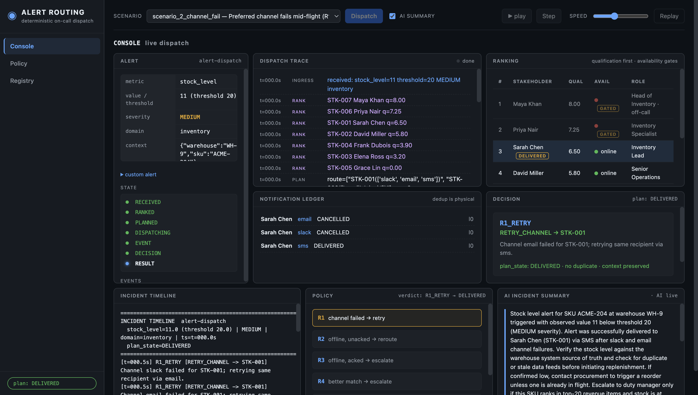

# Alert Routing Agent

> **Author:** Victor Ibhafidon — **date:** 2026-08-14

A deterministic, event-driven **alert routing agent** that decides *which
stakeholder to notify* when an operational metric breaches a threshold — and
re-plans the dispatch **in real time** when availability, channel health, or the
qualified population changes mid-flight.

**Zero third-party dependencies in the core** — Python 3.10+ standard library
only (`sqlite3`, `dataclasses`, `json`, `argparse`). The routing core is a
deterministic policy engine (R1–R6), not an LLM — because the hard requirements
here are *correctness guarantees*, and determinism is what makes them provable.



## The problem

> Build an agent that monitors operational metrics, plans a dispatch route to the
> right stakeholder, and — mid-dispatch — discovers the recipient went offline,
> their preferred channel failed, or a more senior stakeholder became available.
> It must decide in **real time** whether to abort and re-route, or complete and
> escalate in parallel — **without duplicate notifications, without querying
> availability twice for the same person, and without escalating to someone less
> qualified just because they are online.**

## The guarantees (enforced physically, not by convention)

| Guarantee | How it's enforced |
|---|---|
| **No duplicate notifications** | SQLite ledger: check-then-claim (every send is an `INTENT` inserted in the same transaction as the duplicate check) + `UNIQUE (alert_id, stakeholder_id, channel, escalation_level)` + a claim-time guard rejecting any second notification to the same stakeholder for the same alert. |
| **No double-querying availability** | Availability is read **exactly once** per stakeholder per dispatch, then frozen. The `snapshots` table has `PRIMARY KEY (alert_id, stakeholder_id)` — a second read is a physical `IntegrityError`. After that, the change detector only **diffs events** against the frozen snapshot. Events are the query. |
| **No downgrade** | Rank by `qualification = expertise × (1 + (seniority−1)×0.15)`; availability is a **gate**, never a rank key. Route is built once and is immutable — re-planning moves a cursor, it never re-ranks against current availability. `MIN_REROUTE_DELTA` (1.5) prevents interrupting a dispatch for a marginal gain. |
| **Full context + explanation** | Every notification embeds the complete alert payload (`metric`, `value`, `threshold`, `severity`, raw `context`) plus a *why-you-were-chosen* rationale composed from the same decision-log templates. |

## Architecture

```
alert event ──▶ ROUTER (the agent)
                  │
                  ├─ RANKER      qualification score (expertise × seniority) — pure
                  ├─ SNAPSHOTTER availability read ONCE per stakeholder, frozen
                  ├─ PLANNER     immutable route (primary + backups, channel fallback chain)
                  ├─ DISPATCHER  check-then-claim via SQLite ledger, send via adapters
                  ├─ CHANGE DETECTOR  diffs presence/channel events vs the snapshot
                  ├─ DECISION POLICY  R1–R6 → COMPLETE | REROUTE | ESCALATE_PARALLEL
                  │                    | ABORT | RETRY_CHANNEL | IGNORE
                  └─ TIMELINE    renders decision_log as an incident timeline
```

### Decision rules (the part to defend)

- **R1** — channel failed → retry the **same recipient** on their next preferred
  channel (transport ≠ recipient problem).
- **R2** — recipient offline, send **not acked** → abort + re-route to next-ranked
  backup (snapshot order).
- **R3** — recipient offline, send **already acked** → complete + **escalate in
  parallel** to next-ranked backup. (Email is fire-and-forget — an accepted email
  can't be recalled.)
- **R4** — better-qualified candidate available and `candidate_q − current_q >=
  MIN_REROUTE_DELTA` → re-route (unacked) or escalate (acked).
- **R5** — worse/equal candidate online → `IGNORE` (the no-downgrade rule, logged).
- **R6** — targets exhausted / escalation cap (3) → abort, alert marked
  `UNRESOLVED`, context preserved in the ledger for a human.
- **R4c** — HIGH/CRITICAL, no ack within window → escalate to next tier (ack
  timer evaluated at control points).

## Quick start

**No dependencies, no install required.** Python 3.10+ only.

```bash
# 1. Run scenario 1 — recipient goes offline mid-flight → abort + re-route
python3 -m alert_routing.cli scenarios/scenario_1_offline.json

# 2. Channel failure → fallback to the same recipient's email
python3 -m alert_routing.cli scenarios/scenario_2_channel_fail.json

# 3. More senior stakeholder appears, but lower domain qualification → no downgrade
python3 -m alert_routing.cli scenarios/scenario_3_no_downgrade.json

# 4. Full test suite (unit + scenario + invariant tests)
python3 -m unittest discover
```

### Run it anywhere (optional)

The project is also a proper, installable package. From the repo root:

```bash
python3 -m venv .venv && source .venv/bin/activate   # optional, recommended
pip install -e .        # zero third-party deps; gives you the `alert-routing` command
make test               # or: python3 -m unittest discover
make run1               # or: alert-routing scenarios/scenario_1_offline.json
make run2
make run3
make run-all            # all three scenarios back-to-back
```

Each CLI run prints the full dispatch **trace** and then the **incident timeline**
(who was notified when, what changed, why re-routed, and the exact message the
final recipient received). Persist the ledger with `--ledger /tmp/ledger.db` and
re-render the timeline for any alert.

### Zero-dependency web UI (stdlib only — no install needed)

A dark ops-console dashboard that makes the agent's decision-making *visible*
for the demo. It reuses the exact same router code path as the CLI — the UI
contains zero routing logic.

```bash
make ui            # or: python3 -m alert_routing.ui --port 8000
# open http://127.0.0.1:8000/
```

The dashboard shows, in one screen:

- **Alert panel** — the ingress payload + a "send custom alert" JSON form.
- **Stakeholder ranking** — qualification-first table (qual, availability,
  GATED tag for offline/off-call), with the selected recipient highlighted live.
- **Dispatch state machine** — `RECEIVED → RANKED → PLANNED → DISPATCHING →
  CHANGE DETECTED → POLICY DECISION → RESULT`, lighting up as the trace plays.
- **Dispatch trace** — the exact trace the CLI prints, animated, step/pause/replay.
- **Decision card** — the last policy decision: rule code, action, target,
  full rationale, result.
- **Notification ledger** — recipient/channel/status per notification (proves
  no-duplicate physically).
- **Incident timeline** — `render_timeline()` output including the message as sent.
- **Policy matrix** — R1–R6 chips that light up when a rule fires.
- **Registry drawer** — read-only stakeholder registry (click ☰ registry).

### Optional HTTP API

The demo does not need this. If you want the API surface:

```bash
pip install fastapi uvicorn
python3 -m uvicorn alert_routing.server:app
curl -X POST http://127.0.0.1:8000/alert \
  -H 'content-type: application/json' \
  -d '{"metric":"stock_level","value":12,"threshold":20,"severity":"HIGH","domain":"inventory","context":{"warehouse":"WH-4"}}'
```

## Scenario walkthrough (what the demo shows)

| Scenario | What happens | Policy |
|---|---|---|
| `scenario_1_offline.json` | Critical stock alert → **Sarah** (q 6.50) selected, Slack dispatch begins → Sarah goes **offline** mid-flight → send not acked → **abort + re-route** to next-ranked **David** (q 5.80) | R2 |
| `scenario_2_channel_fail.json` | Slack provider **fails** mid-flight → Sarah is still the correct recipient → retry **same person via email** (channel fallback, no re-route to a worse person) | R1 |
| `scenario_3_no_downgrade.json` | **Elena** (seniority 5 — most senior) becomes available → but her inventory qualification (3.20) is far below Sarah's (6.50) → **refused**, Sarah stays primary | R5 |

Each run also prints the ranking, which shows **Maya (q 8.00)** and **Priya
(q 7.25)** above Sarah — they're on-call but offline at the snapshot, so they're
gated out (and if they come online mid-flight, the `MIN_REROUTE_DELTA` gate
decides whether it's material enough to interrupt).

## Repository layout

```
alert_routing/
  models.py       dataclasses: Alert, Stakeholder, Plan, Notification, Verdict, ...
  registry.py     JSON stakeholder loader + validation
  ranker.py       qualification scoring (pure)
  snapshotter.py  one-time availability eval (single-eval guarantee)
  planner.py      immutable route + channel fallback chains
  ledger.py       SQLite ledger: check-then-claim dedup, decision log
  presence.py     simulated presence service + event emitter
  channels.py     email/slack/sms adapters (stubbed, faithful semantics)
  changes.py      change detector (diff vs snapshot)
  decision.py     policy R1–R6 + MIN_REROUTE_DELTA
  router.py       orchestrator (dispatch / on_event / acknowledge / close)
  cli.py          scenario driver + trace printer
  timeline.py     incident timeline UI
  ui.py           zero-dependency web dashboard (stdlib http.server)
  static/         index.html + style.css + app.js (dark ops-console dashboard)
  server.py       optional FastAPI (never imported by core)
scenarios/        the 3 demo scenario JSONs
registry.json     stakeholder seed (7 people, overlapping expertise)
tests/            unit + scenario + invariant tests
```

## Design decisions & tradeoffs (short version)

Full defense in [`BLUEPRINT.md`](BLUEPRINT.md) §12 and in
[`INTERVIEW_GUIDE.md`](INTERVIEW_GUIDE.md) §3–§7.

1. **Deterministic policy engine, not an LLM** — the constraints are correctness
   properties; an LLM can't prove them and adds nondeterminism to paths that
   "must not" fail. LLM is scoped to prose, downstream.
2. **Qualification-first, availability as gate** — structurally can't page a
   worse match just because they're online.
3. **Abort only what you can recall** — ack = terminal for the send; acked ⇒
   complete + escalate in parallel.
4. **`MIN_REROUTE_DELTA` (1.5)** — don't interrupt a live dispatch for a
   marginal improvement.
5. **At-most-once dedup** — crash between claim and send ⇒ possible miss
   (covered by escalation), never a duplicate.
6. **SQLite as the ledger** — ACID transactions *are* the enforcement mechanism.
7. **Event-driven change detection** — polling would be a double-query (banned).
8. **Channels stubbed-but-faithful by default, real delivery is opt-in** — email
   is fire-and-forget, Slack/SMS are presence-aware. Real SMTP/Slack webhook
   adapters drop in behind the same interface when `.env` is configured (below).

## Live delivery + AI (opt-in, env-gated)

Everything below is **off by default** — the demo, tests, and determinism checks
never depend on it. Set `.env` (copy from `.env.example`, never commit it) to
turn each piece on.

**Real email (SMTP relay):**
```bash
ALERT_SMTP_HOST=smtp.gmail.com
ALERT_SMTP_PORT=587
ALERT_SMTP_USER=you@gmail.com
ALERT_SMTP_PASS=<app-password>
```
Each stakeholder's email address comes from `registry.json` `channels[].endpoint`.
SMTP acceptance = ACK (R3 semantics preserved); transport errors = RETRIABLE →
the router falls back to the next preferred channel.

**Real Slack (incoming webhooks, one per channel):**
```bash
ALERT_SLACK_WEBHOOKS='{"sarah.slack":"https://hooks.slack.com/services/T000/B000/XXX","david.slack":"https://hooks.slack.com/services/T000/B000/YYY"}'
```
The key is the channel endpoint from `registry.json`. An endpoint without a
wired webhook is RETRIABLE → honest fallback, never a faked ACK.

**AI prose layer (Anthropic, AFTER the decision only):**
```bash
ALERT_AI_API_KEY=sk-ant-...
ALERT_AI_MODEL=claude-haiku-4-5
```
Writes the human-friendly notification body and the incident summary
(`python -m alert_routing.cli scenarios/scenario_1_offline.json --summary`).
The routing decision is always deterministic; AI output can never change who is
notified. Unset key or API failure ⇒ deterministic template (fails safe).

**Live trigger — metrics feed:**
```bash
make serve &                       # FastAPI server on http://127.0.0.1:8000
python -m alert_routing.metrics_feed --url http://127.0.0.1:8000/alert
```
Simulated warehouse/cold-chain/compute telemetry streams metric values until
each threshold is crossed, POSTing real alerts into the running server.

**LLM proposes, the invariant suite decides:**
```bash
python -m alert_routing.propose_scenario "a channel fails then recovers mid-flight"
```
The LLM drafts a candidate scenario; the deterministic suite ADOPTS or
REJECTS it (clean run + P2 no-dup + P5 reproducibility + exercises an
availability change). Adopted scenarios land in `scenarios/proposed/`.

## What I'd do next with more time

- On-call rotation calendars (PagerDuty-style) instead of a boolean `on_call`.
- A real event bus (Kafka/Redis pub-sub; partition key = `alert_id`) with
  replay — event replay is already idempotent. The scale-out seam is
  `Presence.subscribe` + the durable ledger.
- A webhook ingress adapter for Prometheus Alertmanager (`/webhook/alertmanager`)
  so existing monitoring stacks can push alerts in (the API already accepts
  the same alert schema).
- Incident UI on top of the timeline renderer (the data is all in the ledger).
- Chaos tests: kill the process at random ledger points, restart, assert the two
  dedup invariants still hold.
- Calibrate the seniority weight from real resolution data.
- Full RAG over runbooks/past incidents for *post-decision* AI analysis
  (retrieval stays out of the routing path; the routing decision remains
  deterministic). A zero-dependency slice is already shipped: `runbooks/*.md` +
  a deterministic scorer feeding the incident summary.

### Would an AI chat be wise to add later? (asked in prep)

Yes — but **as the product's interface layer, not as the router**. A chat
assistant that can only *explain* the decision log, ledger and timeline is
read-only and therefore cannot break the guarantees; it's the natural console
companion for the same on-call user. The seam already exists: prose is injected
from the entry point, so a chat endpoint would call the same read-only views.
What it must never do is participate in routing — the deterministic core stays
untouched. If asked in the interview, the answer is: "AI as the explainer, not
the decider; same contract as the 'why you' line."

### Why not Kafka in the core? (asked in prep)

Kafka buys three things this system already provides more cheaply:
1. **Durability/ordering** — the ledger gives durable, ordered, idempotent
   records; replay is already safe.
2. **Buffering/backpressure** — bursty ingress is buffered by the HTTP server
   queue; at this scale a broker is a dependency, not a feature.
3. **Fan-out** — you can add consumers (analytics, runbook AI) later against the
   same ledger, exactly what a broker would enable.

The honest answer: Kafka is the *scale-out* path (partition key = `alert_id`),
and the seam is documented (`Presence.subscribe` + ledger). Adding it now would
violate the brief's "small that genuinely works beats large that does not".

## Related docs

- [`BLUEPRINT.md`](BLUEPRINT.md) — full engineering spec (14,740 words): data model, DDL, policy matrix, edge cases, test plan, demo script.
- [`TESTING.md`](TESTING.md) — step-by-step verification guide: how to prove each of the five guarantees (no alert loss, no duplicates, no double-query, no downgrade, determinism).
- [`INTERVIEW_GUIDE.md`](INTERVIEW_GUIDE.md) — edge cases, defendable decisions, likely interviewer Q&A, phase-by-phase lessons learned, cheat sheet.
- [`ROADMAP.md`](ROADMAP.md) — build status + handoff protocol for future sessions.

## License

MIT (see `LICENSE`).
